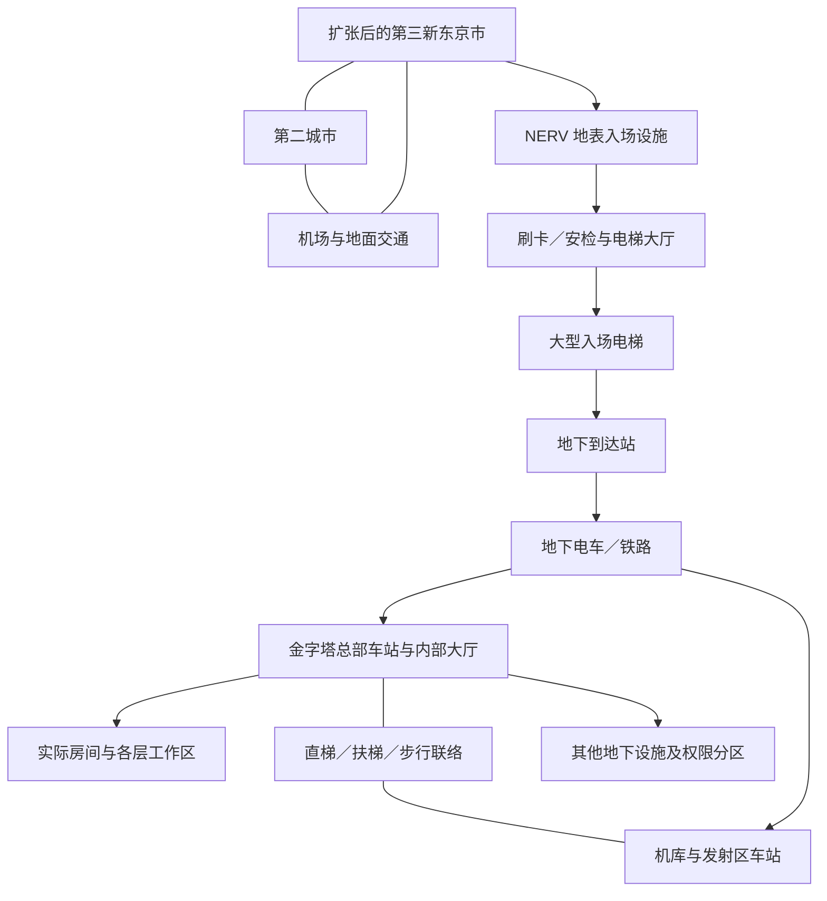

# TV 世界补全：需求与实施日志

记录时间：2026-09-06。此文件合并负责人两次扩建要求，作为后续工作的当前任务清单。
2026-09-07 更新：本轮施工已落盘。负责人随后要求收尾并人工验收，现已暂停施工和自动测试；详细路线与验证边界见 [人工验收说明](WORLD_EXPANSION_ACCEPTANCE.md)。

## 基线与本次修订

- 在当前 `SEELE_TV_WORLD_PREVIEW_20260906` 上继续补全，沿用现有种子，保留已认可的
  建筑、动作、功能和玩家之后的修改。实施前从当时的实际存档做冷备份和区域还原补丁。
- 代码基线为 `20cad70`。原 R28、TV 内饰源档继续保留，不能拿旧档覆盖当前进度。
- **撤回“找到并改造遗留空井”的要求。** 负责人肉眼未找到该井，不再把它当作已知目标。
- 替代方案是新建正式的 NERV 地表入场设施、大型入场电梯及地下铁路到达链路。
- 后续已获一次性实施授权，并完成本轮施工；2026-09-07 最新指示改为收尾后人工验收，优先于此前“不停止”的要求。

## 已确认的建设方向

| 编号 | 要求 | 当前状态 |
| --- | --- | --- |
| CITY-01 | 东京大规模扩张 | 已建 194 栋城市楼房与公园；人工体验待验收 |
| CITY-02 | 第二座城市 | 新箱根已建，与 R1/S1 相连 |
| AIR-01 | 机场及城市交通 | 两座机场、A1/S1 接驳及原生 F1 航线已落盘 |
| RAIL-01 | 可运行的复杂铁路 | 98 段轨道、23 站台、7 线路原生运行通过；乘客实乘待验收 |
| NERV-01 | 正式地表入口 | 已建于城市站南侧，约 -360 81 700 |
| NERV-02 | 刷卡进入 | 空手拒绝、职员证开门已在客户端通过 |
| NERV-03 | 大型实际电梯 | 15×15×9 原生轿厢；81 ↔ -466 载人往返通过 |
| NERV-04 | 远端地下到达站至总部电车 | 到达厅、U1、总部站及大厅连接完成 |
| HQ-01 | 金字塔实际房间与分流 | 两翼新增 16 间房，上下层及既有 TV 房间通行扫描通过 |
| GEO-01 | 更多 TV 地下设施 | Sigma 试验、医疗分析、档案、LCL、动力后勤等已补入；既有 MAGI/Dogma 保留 |
| GEO-02 | 残留旧土地层 | 发射区周边确认的旧土层已清理 |
| GEO-03 | 发射区结构支撑 | 新机库基座与站区支撑已建立 |
| EVA-01 | 机库／发射区移离总部 | 整体向北迁移 256 格，身份与原生电梯组保留；三机完整联验待做 |
| WALK-01 | 直梯及加长人行／扶梯联系 | 保留直梯，长移动步道与机库站连接通过扫描 |

## 目标交通关系

以下是负责人要求的连接关系，不是已经确定的官方平面或施工坐标。

地表的城际、机场和城市线路，与地下 NERV 工作交通分别组织，在合理站点换乘。
“复杂”应表现为线路分工、换乘、支线和调度，不能靠无目的绕行制造复杂度。

## 原作调研要求

1. 以原 TV 正片和可核实的官方设定资料为主；区分新剧场版、同人概念图与社区推测。
2. 分别核对地表城市／交通、GeoFront 大形、总部与机库、深层设施的空间关系。
3. 对控制与分析、MAGI、驾驶员相关设施、实验／模拟、整备／插入栓／LCL、动力与后勤、
   Central Dogma／Terminal Dogma 等类别建立场所清单；逐项核实，不把清单直接当成官方楼层图。
4. 明确每个设计属于哪一种：原作可确认的场所与关系；原作未给出完整尺寸的比例复原；
   为游戏交通和可玩性补全的项目设计。未确认的资料不能写成原作事实。
5. 房间必须有用途和真实到达路径。地下车站进入金字塔后，应进入能分流到实际房间的大厅，
   再接各层交通，而不是把出口放在一片空区就宣称连通。

本轮参考依据、原作与项目补全部分的区分记录在 `artifacts/world_expansion_20260907/RESEARCH.md`。上轮资料入口为
`artifacts/geofront_tokyo3_research_20260906/RESEARCH.md` 和原设定参考缓存。

## 现有模组与运行约束

- 已从本地依赖确认 MTR 4.0.5、Moving Elevators 1.4.12；优先使用现有模组实现铁路和电梯。
  其余交通／航空模组、载具与资源包需继续核对实际可调用能力，不假定“装了就已接好”。
- 机场规划应同时考虑航站、跑道／滑行／机坪、货运或维护配套、机场交通换乘；
  具体功能依据原作参考和已安装模组确定。
- 铁路需要真实线路、车辆、站台、换乘、回库和发车运行验证；铺出轨道外形不算完成交通系统。
- 大电梯不能只放大外壳：轿厢捕获范围、门、面板、乘客碰撞、井道净空和停层都要匹配。
- 机库／发射区若迁移，需同步处理床位、发射井、门、插入栓、驾驶员路径、供电、
  武器设施、控制台和持久化坐标。保留机体及插入栓身份，验证完整出击／回收。
- 当前游戏渲染曾影响远景判断，空间检查继续优先使用 `tools/query_blocks.py` 和扫描图；
  功能用运行验证，光照、材质、比例和体验仍由人工验收。

## 分阶段实施顺序

| 阶段 | 要做的事 | 进入下一阶段前应得到的结果 |
| --- | --- | --- |
| 0：调查与总图 | 核对原作、模组和当前存档；定位旧土层、悬空结构、空区及现有入口 | 有依据的设施清单、实测问题图、总体交通图和分区位置方案 |
| 1：地基与地形 | 优先修复发射／机库区域支撑，清理确认的旧土地残留 | 保留现有机械净空和运行能力的可靠地面／结构 |
| 2：确定基地分区 | 决定总部、到达站、机库／发射区和其他地下设施的位置；核实搬迁代价 | 能实施的分区布局，明确哪些设施保留、扩建或整体迁移 |
| 3：NERV 入场主线 | 地表门禁设施、大电梯、地下到达站、到总部的电车线 | 刷卡后能真实乘梯、乘车进入总部内部大厅 |
| 4：总部及地下补全 | 补房间、各层通路和有依据的原作设施；落实机库分区及人行联络 | 大厅连接实际房间，各主要功能区有明确交通与权限边界 |
| 5：城市与区域交通 | 扩张城区，建设机场、第二城市及配套铁路网络 | 城市之间及机场交通可用，站点和街区有实际服务关系 |
| 6：整体验收 | 全程乘车／乘梯／步行、三机出击回收、楼宇升降及重载检查 | 当前存档连贯可玩，再由负责人判断原作观感和细节 |

城市、机场与第二城市的位置必须在阶段 0 就预留，不能等地下工程完成后才发现线路冲突。
若机库迁移会改变支撑范围，阶段 1 先消除现有危险／明显悬空，永久地基与迁移施工统筹安排。

## 当前 GeoFront 已完成到哪一步

现有预览已采用宽浅空腔与中央平顶的比例适配：半径 1800 格、平顶半径 600 格、
顶面 Y=24、地面约 Y=-478。它是依据原作思路按现有游戏设施缩放的大形，
**不能表述为完整球体、完整 NERV 基地或原作的逐米复原已经完成。**

上轮机械往返和电梯测试通过，也不等于所有外部支撑、旧土层、内部房间和交通网络已经补全。
本轮负责人新指出的残留与支撑问题，作为新的实测修复项继续推进。

## 当前交接

按负责人最新要求，先人工验收本阶段。城市已完整升回地面，三台 EVA 均停在新机库，测试服务器已正常保存关闭。
正式门禁和大电梯已实测通过；铁路与飞机的乘客实乘、迁移后三机全流程及保留电梯回归尚未标为完成。
后续按人工反馈继续，不自动重做地形、不重新寻找已撤回的“空井”。
